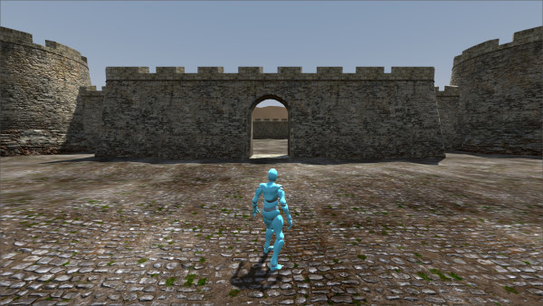

# COURTYARD
Hack and slash shootem action adventure games are lots of fun. Hence, this repository is dedicated to experimentation with them. What better lab environment than the classic castle courtyard!

HERE ARE SOME OF THE PROJECT GOALS (IN NO PARTICULAR ORDER):
- Change character to Knight, Wizard or Witch
- Equip character with sword, bow or pistol
- Improve character animations
- Add dummy target and bullseye targets to walls
- Add fenced off grassy area to keep player away from wall
- Implement combat logic: i.e. Health, Damage and/or Points
- Add enemy character with basic combat AI
- Create Heads Up Display (HUD)
- Create additional surrounding environment: i.e. Trees, Road
- Improve terrain texture(s)

COMPLETED GOALS:
- Add collisions to castle walls
- Create mountains. 

OUT OF SCOPE:
- Create massive open world setting
- Facilitate exploration outside of the courtyard
- Allow characters to fly

(Shout out to PolyHaven.com and Mixamo.com for the widgets).